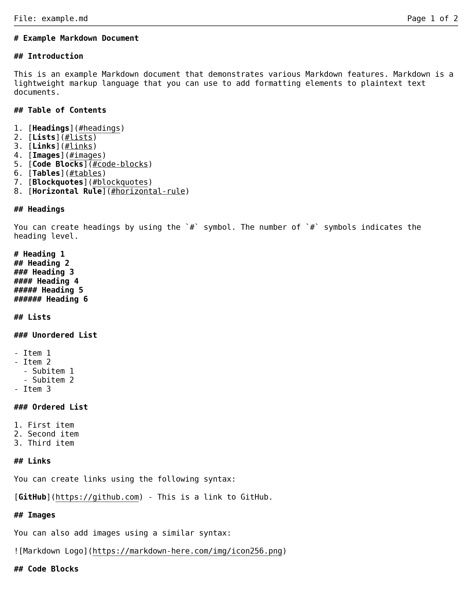
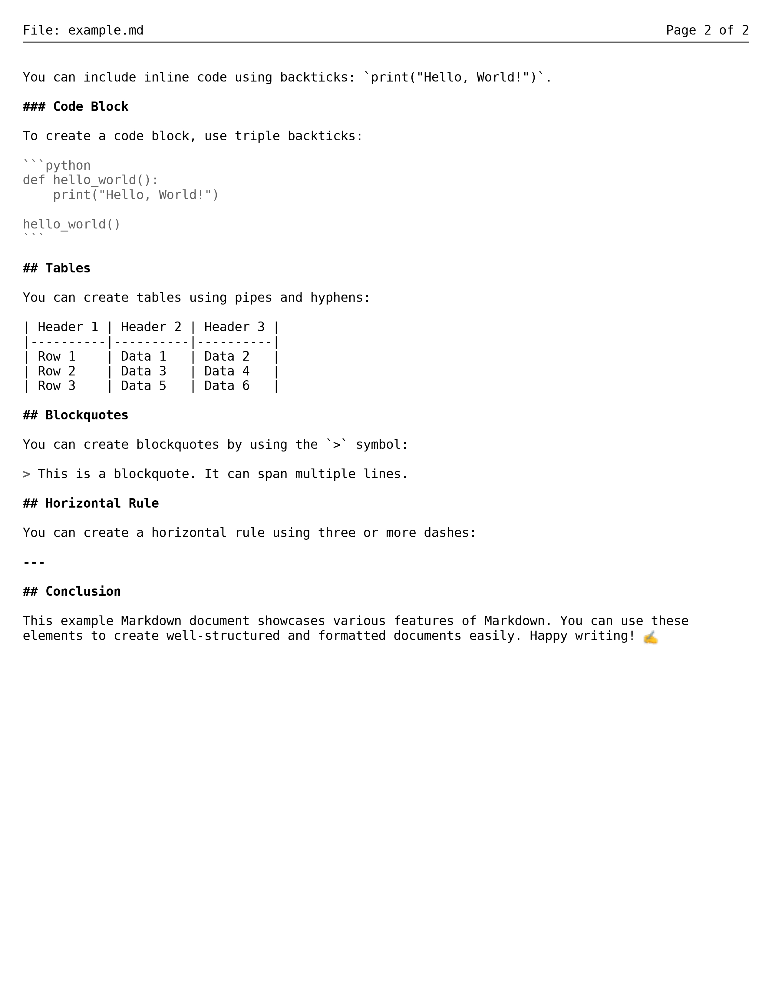
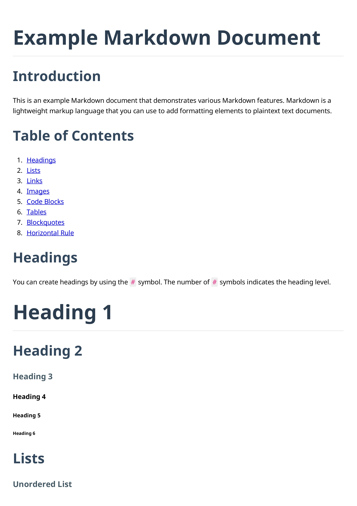
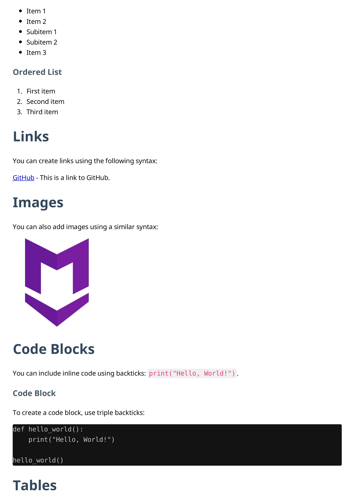
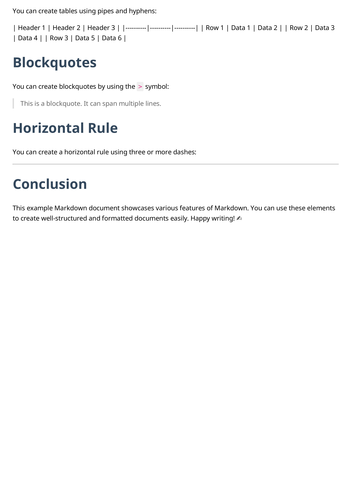

# 🍬 Sugar-MDtoPDF 🍬

## Overview

Welcome to **Sugar-MDtoPDF**! 🎉 The sweetest command-line tool for converting your Markdown files into beautifully formatted PDF documents! 📄✨ Whether you're a writer, developer, or just someone who loves Markdown, this tool is designed to make your life easier by transforming your text into polished PDFs with just a few simple commands. 🚀

## Why This tool

Are you tired of creating pdf for professional work? or you don't have enough time to stay on that shitty workspace and format your docs.
Now no need to do all this.
Just create a `.md` file in markdown language and left everything on this script.

### Example MD file

|  |  |
|:---:|:---:|

### After Using Tool
|  |  |  |
|:---:|:---:|:---:|


## Features

- **Single File Conversion**: Effortlessly convert individual Markdown files to PDF. 📑➡️📄
- **Bulk Conversion**: Convert all Markdown files in a specified directory to PDF in one go—perfect for organizing your documents! 📂➡️📄
- **Customizable Output**: Tailor your PDF's appearance with customizable HTML output and CSS styling. 🎨🖌️
- **Built with Love**: Utilizes the powerful `pdfkit` and `markdown` libraries for seamless conversion. ❤️

## Requirements

To get started, ensure you have the following:

- Python 3.x 🐍
- `pdfkit` library 📦
- `markdown` library 📖
- `wkhtmltopdf` installed on your system (download it from [wkhtmltopdf.org](https://wkhtmltopdf.org/downloads.html) 🌐)

## Installation

1. **Clone the Repository**: Get your own copy of Sugar-MDtoPDF by cloning the repository or downloading the script. 
   ```bash
   git clone https://github.com/Sugarcube08/Sugar-MDtoPDF.git
   cd Sugar-MDtoPDF
   ```

2. **Install Required Libraries**: Use pip to install the necessary libraries:
   ```bash
   pip install -r requirements.txt
   ```

3. **Install wkhtmltopdf**: Make sure `wkhtmltopdf` is installed and accessible in your system's PATH. 🔧
    ```linux
    sudo apt install wkhtmltopdf
    ```

## Usage

### Single File Mode

To convert a single Markdown file to PDF, run the following command:
```bash
python script.py
```
You will be prompted to enter the file path of the Markdown file you wish to convert. 📂

### Bulk File Mode

To convert all Markdown files in a folder to PDF, run the following command:
```bash
python script.py
```
You will be prompted to enter the folder path containing the Markdown files. The script will convert each `.md` file in the folder to a corresponding `.pdf` file. 📂➡️📄

## Example

1. **Single File Conversion**:
   - **Input**: `example.md` 📄
   - **Output**: `example.pdf` 📄✨

2. **Bulk Conversion**:
   - **Input**: `/path/to/markdown/files` 📂
   - **Output**: All `.md` files in the specified folder will be converted to `.pdf` files in the same folder. 📄📄📄

## License

This project is licensed under the MIT License. See the LICENSE file for more details. 📜

## Acknowledgments

A big thank you to:
- [pdfkit](https://github.com/JazzCore/python-pdfkit) for making PDF generation a breeze. 🌬️
- [markdown](https://github.com/Python-Markdown/markdown) for its fantastic Markdown parsing capabilities. 📖✨

## Join the Sweet Revolution! 🍭

Transform your Markdown into delightful PDFs with **Sugar-MDtoPDF**! If you have any questions, suggestions, or just want to share your experience, feel free to reach out. Happy converting! 🎉🥳

---
          
## Made with ❤️ by SugarCube               
---
## ☕ Support Me
If you like this project, consider buying me
 a coffee!
[](https://www.buymeacoffee.com/sugarcube08)   
---
